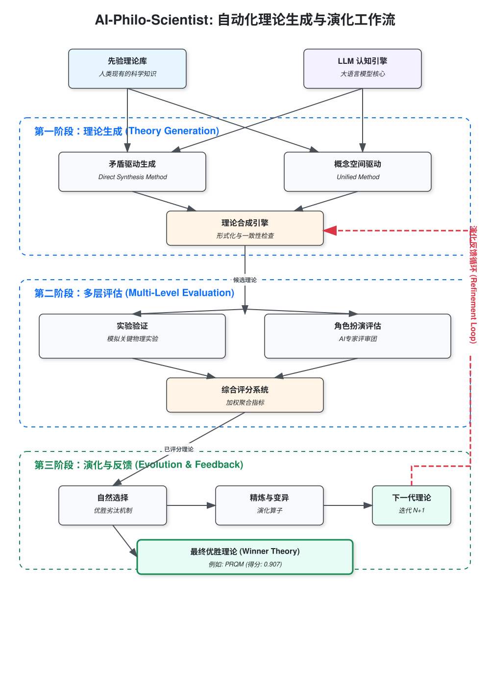

# UniversalTheoryGen - 通用理论生成框架

这是一个通用的哲学-科学跨学科理论生成与探索框架，利用高维语义Embedding空间与大语言模型（LLM）能力，能灵活选用各种不同的理论生成方法，在科学-哲学交叉领域探索和生成新的理论。

## 核心工作流 (Project Workflow)

## 项目结构
UniversalTheoryGen/
│
├── core_embedding/ # 通用Embedding空间构建
│ ├── embedding.py
│ ├── math_parser.py
│ └── vector_space.py
│
├── generation_methods/ # 理论生成方法集合
│ └── concept_relaxation/ # 概念矛盾点放松法
│ ├── contradiction_detector.py # 矛盾概念识别
│ ├── concept_relaxation.py # 概念放松与空间扩展逻辑
│ └── relaxed_theory_generator.py # 新理论生成具体实现
│
├── theory_generation/ # 通用理论生成接口
│ ├── llm_interface.py
│ ├── method_selector.py # 管理和选择不同理论生成方法
│ └── agent_evaluation.py
│
├── math_formalization/ # 数学形式化 (可选)
│ ├── symbolic_engine.py
│ └── math_translator.py
│
├── empirical_validation/           # 经验验证
│   ├── knowledge_base.py
│   ├── predictor.py
│   └── comparator.py
│
├── feedback_loop/                  # 反馈循环与理论调整
│   ├── feedback_analyzer.py
│   └── theory_refiner.py
│
├── visualization/                  # 可视化工具
│   └── visualize_space.py
│
├── applications/                   # 各领域应用案例
│   └── quantum_interpretation/     # 量子力学诠释示范案例
│       ├── domain_data.py
│       ├── domain_prompts.py
│       └── experiments/
│
├── config/                         # 配置文件
│   └── config.yaml
│
├── main.py                         # 主入口
│
├── requirements.txt                # 环境依赖
│
└── README.md                       # 本文档

## 短卡工作流（Short Card Pipeline）
- 理论知识以“短卡”形式存放在 `cards/` 目录，格式遵循 `schemas/card.schema.json`。
- 快速生成短卡：`python pipelines/build_short_cards.py --sources data/theories_v2.1`
- RAG 检索：`python -m pipelines.retrieve_topk "如何融合塌缩与导引方程" --k 6`
- 构建矛盾表：`python pipelines/build_conflicts.py "objective collapse 与 pilot-wave 的折中" --output tmp/contradictions.json`
- 合成新诠释：`python pipelines/synthesize_theory.py tmp/contradictions.json --output tmp/new_interpretation.json`
- 该流程默认使用结构化输出(JSON Schema)和 Top-K 检索，避免一次性塞入全部理论。
- 也可在旧版全流程中直接使用：`python run_direct_synthesis.py --generation_method short_card --short_card_topk 50 ...`；若希望一次跑完整评估，可配合 `run_full_cycle.py --generation_method short_card`。

## 论文编译（paper）
- 依赖：LaTeX 发行版（TeX Live / MacTeX）与 `latexmk`。
- 快速构建：
  - 从仓库根目录运行：`bash scripts/build_paper.sh`
  - 或进入 `paper/` 目录运行：`bash build.sh`
- 输出：
  - 生成 `paper/ai-philo-crossAI-arxiv.pdf`
  - 生成 `paper/warnings_summary.txt`（自动汇总关键告警/错误）
- 日志清理：`build.sh` 会把 `.log/.fls/.fdb_latexmk` 里的绝对路径标准化为相对 `paper/`，便于跨环境复现与分享。

### Makefile 快捷命令
- 生成图：`make figs`
- 生成表：`make tables`
- 生成图表并编译 PDF：`make paper`
- 快速编译（静默）：`make fast`
- 清理构建产物：`make clean`

## 多模型理论评估
- 默认评估器会根据理论的 `math_relation_to_SQM` 自动选择模型组合：
  - 与标准量子力学兼容的理论：优先沿用调用方的主模型，并补充一次 `openai:gpt-4o-mini` 复核。
- 修改 SQM 的理论：在角色评估基础上额外加入 `openai:gpt-4o-mini` 与 `google:gemini-2.5-flash` 的仪器/实验可行性审查，并与角色评分做加权平均。
- 可通过 `ROLE_EVAL_MODELS` 或 `--role_eval_models` 手动覆盖，格式如 `openai:gpt-4o-mini,deepseek:deepseek-chat`。
- 评估结果会保存 `instrumentation_review` 字段，包含各模型对实验可行性的反馈与得分。
