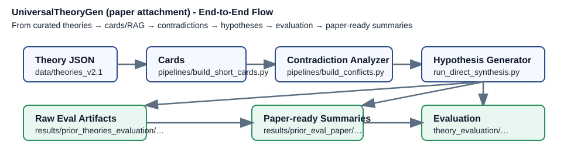

# Paper Quicklook (for reviewers)

本页提供论文附件的快速入口与全流程示意，方便评审直接定位核心结果。

## 最终排名摘要（按理论名排序的精简版）

| Run ID | Summary JSON | #Theories | Top‑3 (success_rate / avg_chi2) |
| --- | --- | --- | --- |
| run_20251007_prior_eval | results/prior_eval_paper/run_20251007_prior_eval/final_evaluation_summary.json | 11 | 1) Consistent Histories (1.0 / 0.0)  2) Copenhagen Interpretation (1.0 / 0.0)  3) Ensemble Interpretation (1.0 / 0.0) |
| run_20251008_prior_eval_multi | results/prior_eval_paper/run_20251008_prior_eval_multi/final_evaluation_summary.json | 9 | 1) Consistent Histories (1.0 / 0.0)  2) Ensemble Interpretation (1.0 / 0.0)  3) Many-Worlds Interpretation (1.0 / 0.0) |

更细粒度的实验对比、原始响应可在 `results/prior_theories_evaluation/` 下按理论名查看。
